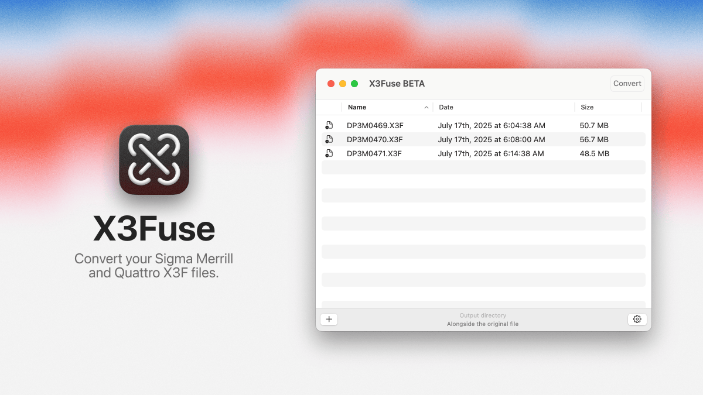

# X3Fuse

A modern macOS app for converting Sigma Merrill and Quattro X3F RAW files.



## Overview

X3Fuse is a RAW conversion tool that converts your Sigma Merrill and Quattro X3F files into practical, compatible formats like DNG, TIFF, and JPEG. It's an essential bridge between your Sigma cameras and your preferred editing suite. Works best with Lightroom and Capture One.

## Features

- **Multiple Output Formats**: Convert X3F files to DNG, TIFF, or JPEG formats
- **Batch Processing**: Process multiple files at once with an intuitive queue system
- **Native macOS App**: Built with SwiftUI for a seamless macOS experience
- **EXIF Data Preservation**: Attempts to preserve metadata like preferred aspect ratio
- **Multi-language Support**: Available in English, Japanese, Korean, and Chinese\*
- **Drag & Drop Interface**: Simple file management with drag and drop support
- **Conversion Settings**: Customizable output options for your workflow

* Don't see your language? Help us translate! See [Contributing](#contributing) below.

## Supported Cameras

X3Fuse supports X3F files from Sigma cameras including:

- Sigma Merrill series cameras
- Sigma Quattro series cameras

This app has been tested with photos taken with various Sigma models, including:

- Sigma DP2 Merrill
- Sigma DP3 Merrill
- Sigma DP0 Quattro
- Sigma DP2 Quattro
- Sigma SD Quattro H

If you have a Sigma Foveon camera from the Merrill and Quattro generations that are not listed here, please let us know! We aim to support all Sigma X3F files and are actively looking for additional test files to improve compatibility.

## System Requirements

- macOS 14.0 (Sonoma) or later
- Apple Silicon (M1, M2, etc)

## Installation

### Option 1: Download Release

1. Download the latest .zip from the [Releases](https://github.com/sagwaco/x3fuse/releases) page
2. Extract the .zip file and move the `X3Fuse.app` to your Applications folder.
3. Launch `X3Fuse.app` from your Applications folder.

### Option 2: Build from Source

1. Clone the repository:
   ```bash
   git clone https://github.com/sagwaco/x3fuse.git
   cd x3fuse
   ```
2. Open `X3Fuse.xcodeproj` in Xcode
3. Build and run the project (⌘+R)

## Usage

1. **Launch X3Fuse** from your Applications folder

2. **Add Files**:

   - Drag and drop X3F files onto the app window
   - Or use File → Open to browse for files

3. **Configure Settings**:

   - Choose your output format (DNG, TIFF, or JPEG)
   - Set output directory preferences
   - Adjust conversion options as needed

4. **Convert**:
   - Click the Convert button to start processing
   - Monitor progress in the queue view
   - Converted files will be saved to your specified location

## Known Issues

#### DNGs look broken in Quick Look

Foveon cameras do not have a color filter array (CFA) like most other cameras, and the lack of a CFA, among other differences, can cause some applications like Quick Look to misinterpret the RAW data. If you encounter this issue, please use an alternative viewer or editor to confirm the integrity of the DNG files. The files should open correctly in applications like Adobe Lightroom or Capture One.

#### X3I files not supported

X3I files generated in Quattro Super fine detail (SFD) mode are not supported. A workaround is to shoot several exposure bracketed images as X3Fs and then use X3Fuse to convert them to DNG. In a photo editing application like Lightroom, you can then merge the DNG files into an HDR image.

## Technical Details

X3Fuse leverages:

- **x3f_tools**: Core X3F file processing engine
- **ExifTool**: Comprehensive metadata handling

## Acknowledgements

Thank you to the kalpanika team for x3f_tools https://github.com/Kalpanika/x3f:

- Roland Karlsson (roland@proxel.se)
- Erik Karlsson (erik.r.karlsson@gmail.com)
- Mark Roden (mmroden@gmail.com) - [anisotropic filtering parts]

## License

This project is licensed under the terms specified in the [LICENSE](LICENSE) file.

## Contributing

Contributions are welcome! Please feel free to submit a [Pull Request](https://docs.github.com/en/pull-requests/collaborating-with-pull-requests/proposing-changes-to-your-work-with-pull-requests/creating-a-pull-request).

## Support

If you encounter any issues or have questions:

- Open an issue on [GitHub Issues](https://github.com/sagwaco/x3fuse/issues)
- Check the [Releases](https://github.com/sagwaco/x3fuse/releases) page for updates

## Privacy

X3Fuse processes all files locally on your Mac. No data is sent to external servers.
