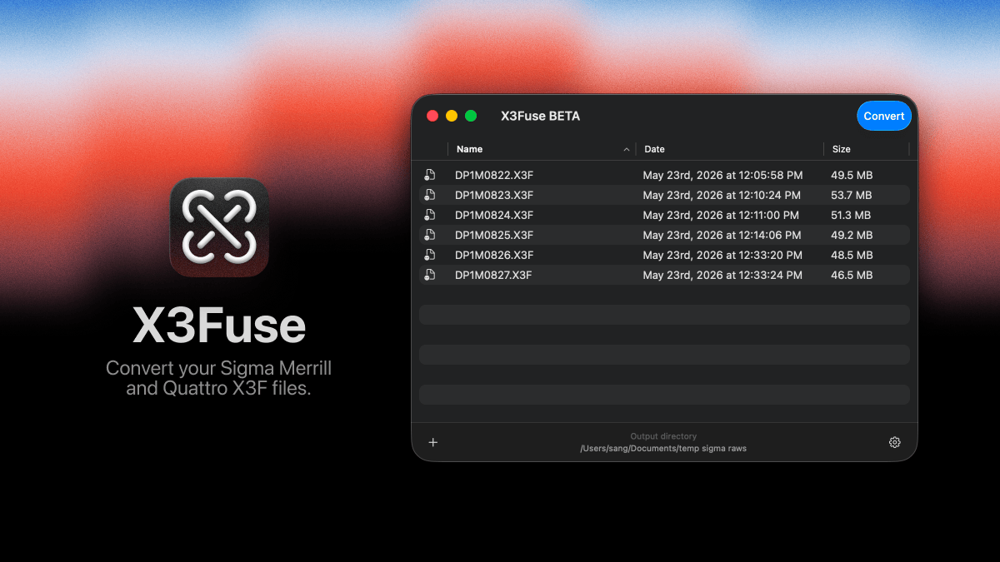

# X3Fuse

A modern macOS app for converting Sigma Merrill and Quattro X3F RAW files.



## Overview

X3Fuse is a RAW conversion tool that converts your Sigma Merrill and Quattro X3F files into practical, compatible formats like DNG, TIFF, and JPEG. It's an essential bridge between your Sigma cameras and your preferred editing suite, including apps that use Adobe Camera Raw (Lightroom, Photoshop), LibRaw (Darktable, RawTherapee, RapidRAW), and Apple's RAW engine (Pixelmator, Photomator, Preview).

## Features

- **Multiple Output Formats**: Convert X3F files to DNG, TIFF, or JPEG formats
- **Batch Processing**: Process multiple files at once with an intuitive queue system
- **Native macOS App**: Built with SwiftUI for a seamless macOS experience
- **EXIF Data Preservation**: Attempts to preserve metadata like preferred aspect ratio
- **Broad DNG Compatibility**: Merrill and Quattro DNGs are tested with Adobe, LibRaw, and Apple RAW-based workflows
- **Multi-language Support**: Available in English, Japanese, Korean, and Chinese\*
- **Drag & Drop Interface**: Simple file management with drag and drop support
- **Conversion Settings**: Customizable output options for your workflow

* Don't see your language? Help us translate! See [Contributing](#contributing) below.

## Supported Cameras

X3Fuse supports X3F files from Sigma cameras including Merrill and Quattro series cameras.

| Camera Model           | Tested | Untested |
| ---------------------- | ------ | -------- |
| **Merrill Generation** |        |          |
| Sigma DP1 Merrill      | ✅     |          |
| Sigma DP2 Merrill      | ✅     |          |
| Sigma DP3 Merrill      | ✅     |          |
| Sigma SD1 Merrill      | ✅     |          |
| **Quattro Generation** |        |          |
| Sigma DP0 Quattro      | ✅     |          |
| Sigma DP1 Quattro      | ✅     |          |
| Sigma DP2 Quattro      | ✅     |          |
| Sigma DP3 Quattro      | ✅     |          |
| Sigma SD Quattro       | ✅     |          |
| Sigma SD Quattro H     | ✅     |          |

If you have a Sigma Foveon camera from the Merrill and Quattro generations that are not listed here, please let us know! We aim to support all Sigma Merrill and Quattro cameras and are actively looking for additional test files to improve compatibility.

## System Requirements

- macOS 14.0 (Sonoma) or later
- Intel or Apple Silicon

## Installation

### Option 1: Download Release

1. Download the latest .zip from the [Releases](https://github.com/sagwaco/x3fuse/releases) page
2. Extract the .zip file and move the `X3Fuse.app` to your Applications folder.
3. Launch `X3Fuse.app` from your Applications folder.


### Option 2: Homebrew

```bash
brew install --cask sagwaco/tap/x3fuse
```

Upgrade later with `brew upgrade --cask x3fuse` (the app also self-updates in-app via Sparkle).

### Option 3: Build from Source

1. Clone the repository:
   ```bash
   git clone https://github.com/sagwaco/x3fuse.git
   cd x3fuse
   ```
2. Open `X3Fuse.xcodeproj` in Xcode
3. Build and run the project (⌘+R)

## Scripts

### verify_universal_build.sh

```bash
./scripts/verify_universal_build.sh
```

This script verifies that the app and its components are properly built as universal binaries. It checks the architecture of the main app executable and any embedded binaries, ensuring they support both Intel and Apple Silicon architectures.

## Usage

1. **Launch X3Fuse** from your Applications folder

2. **Add Files**:
   - Drag and drop X3F files onto the app window
   - Or use File → Open to browse for files

3. **Configure Settings**:
   - Choose your output format (DNG, TIFF, or JPEG)
   - Set output directory preferences
   - Adjust conversion options as needed

4. **Convert**:
   - Click the Convert button to start processing
   - Monitor progress in the queue view
   - Converted files will be saved to your specified location

## DNG Compatibility

X3Fuse creates DNGs that are designed to work across common RAW decoding engines, not only Adobe Camera Raw. Merrill and Quattro files, including DNGs created with **RAW compression** and/or **Merrill highlight recovery** enabled, have been tested successfully in:

- Adobe Lightroom and Adobe Photoshop
- Darktable
- RawTherapee
- RapidRAW
- Pixelmator and Photomator
- Preview on macOS

Foveon cameras do not have a color filter array (CFA) like most other cameras, so some RAW applications may still have Foveon-specific rendering differences. If you encounter an issue with a particular editor, please open a GitHub issue with the camera model, conversion settings, and target application.

## Known Issues

#### X3I files not supported

X3I files generated in Quattro Super fine detail (SFD) mode are not supported. A workaround is to shoot several exposure bracketed images as X3Fs and then use X3Fuse to convert them to DNG. In a photo editing application like Lightroom, you can then merge the DNG files into an HDR image.

## Technical Details

X3Fuse leverages:

- [**x3fuse-core**](https://github.com/sagwaco/x3fuse-core): Core X3F file processing engine
- [**ExifTool**](https://github.com/exiftool/exiftool): EXIF Metadata handling

## Acknowledgements

[x3fuse-core](https://github.com/sagwaco/x3fuse-core), which powers the x3f processing in x3fuse is based on [x3f_tools](https://github.com/Kalpanika/x3f). This project is not affiliated with nor endorsed by the creators of x3f_tools.

## License

This project is licensed under the terms specified in the [LICENSE](LICENSE) file.

This project is not affiliated nor endorsed by Sigma Corporation. Sigma and Foveon are trademarks of Sigma Corporation.

## Contributing

Contributions are welcome! Please feel free to submit a [Pull Request](https://docs.github.com/en/pull-requests/collaborating-with-pull-requests/proposing-changes-to-your-work-with-pull-requests/creating-a-pull-request).

## Support

If you encounter any issues or have questions:

- Open an issue on [GitHub Issues](https://github.com/sagwaco/x3fuse/issues)
- Check the [Releases](https://github.com/sagwaco/x3fuse/releases) page for updates

## Privacy

X3Fuse processes all files locally on your Mac. No data is sent to external servers.
